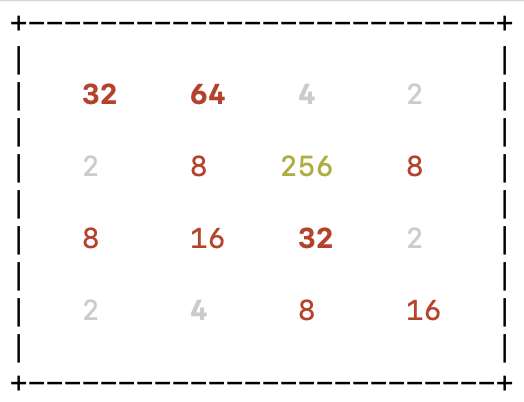
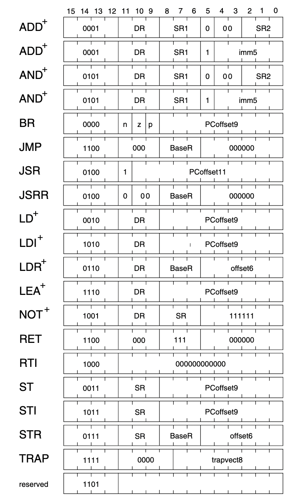

# 2048-assembly-vm



[LC3](https://en.wikipedia.org/wiki/Little_Computer_3) assembly VM that plays the 2048 game inside your terminal.

### How to play

Download and type the following into the console:

```bash
gcc lc3.c && ./a.out 2048.obj
```

### Project Information
#### LC-3 Assembly

Tutorial: https://www.jmeiners.com/lc3-vm/

LC3 ISA Docs: https://www.jmeiners.com/lc3-vm/supplies/lc3-isa.pdf

```
.ORIG x3000                        ; memory address where program will be loaded
LEA R0, HELLO_STR                  ; load address of HELLO_STR string into R0
PUTs                               ; output string pointed to by R0 to console
HALT                               ; halt program
HELLO_STR .STRINGZ "Hello World!"  ; store string here in the program
.END                               ; mark end of the file
```

#### ISA Formats


